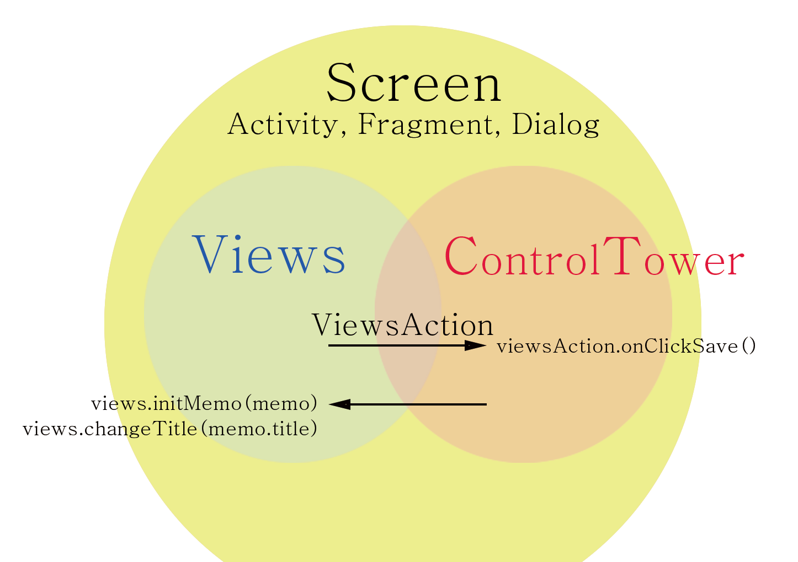

# SVC

**Easy** and **intuitive** pattern **library** for Android


## Why SVC?

MVP and MVVM use Fragment or Activity as "VIew"

So when we write code inside the Fragment or Activity, codes are getting mixed with
"View" code and "Screen Code" such as `onCreate,onCreateView, onViewCreated` or `onSaveInstanceState, onRestoreInstanceState `.`onActivityResult` etc.

It makes hard to see each "View Logic" and "Screen Logic"

And the most important thing is that "Business Logic" easily get Inside of the "View"(Fragment, Activity).

It's because Activity, Fragments are actually "Control Tower"

SVC is the how to divide Screen |View| Business Logics.


For more read check article below

1. 1. 4 reasons why MVP is not good enough
      [https://medium.com/@bansooknam/intro-svc-the-better-pattern-against-mvp-138e6e790bbc](https://medium.com/@bansooknam/intro-svc-the-better-pattern-against-mvp-138e6e790bbc)

   2. Detail concept of SVC
      [https://medium.com/@bansooknam/svc-the-better-pattern-against-mvp-66e6d342a23f](https://medium.com/@bansooknam/svc-the-better-pattern-against-mvp-66e6d342a23f)


Ps. It can be used with ViewModel as Well.
you can check an example here below.
https://github.com/BansookNam/android-architecture


## Examples

### 1. Activity

```kotlin
class MainActivity : SvcBaseActivity<MainViews, MainCT>() {
    override fun createViews() = MainViews(this)
    override fun createControlTower() = MainCT(this, views)
}

```

### 2. Fragment

```kotlin
class StatisticFragment : SvcBaseFragment<StatisticViews, StatisticCT>() {
    override fun createViews() = StatisticViews(this)
    override fun createControlTower() = StatisticCT(this, views)
}
```


You can really **divide** "Views" from Activity and Fragment.

so you can see logic about real Fragment and Activity very well like below. ([source link](https://github.com/BansookNam/android-architecture/blob/todo-svc-kotlin/todoapp/app/src/main/java/com/example/android/architecture/blueprints/todoapp/screen/taskdetail/TaskDetailActivity.kt))

```kotlin
class TaskDetailActivity : SvcBaseActivity<TaskDetailViews, TaskDetailCT>() {

    override fun createControlTower() = TaskDetailCT(this, views, taskId!!)
    override fun createViews() = TaskDetailViews(this)

    var taskId: String? = null

    override fun onCreate(savedInstanceState: Bundle?) {
        /**
         * we should set taskId before super onCreate
         * because createControlTower will be called on super.onCreate()
         * and taskId is non null String type in constructor of TaskDetailCT
         */
        taskId = intent.getStringExtra(EXTRA_TASK_ID)

        super.onCreate(savedInstanceState)
    }

    override fun onSupportNavigateUp(): Boolean {
        onBackPressed()
        return true
    }


    override fun onOptionsItemSelected(item: MenuItem): Boolean {
        val deletePressed = item.itemId == R.id.menu_delete
        if (deletePressed) ct.deleteTask()
        return deletePressed
    }

    override fun onCreateOptionsMenu(menu: Menu?): Boolean {
        menuInflater.inflate(R.menu.taskdetail_fragment_menu, menu)
        return true
    }

    fun startEditTastActivity(taskId: String) {
        val intent = Intent(this, AddEditTaskActivity::class.java)
        intent.putExtra(AddEditTaskActivity.ARGUMENT_EDIT_TASK_ID, taskId)
        startActivityForResult(intent, REQUEST_EDIT_TASK)
    }

    override fun onActivityResult(requestCode: Int, resultCode: Int, data: Intent?) {
        if (requestCode == REQUEST_EDIT_TASK) {
            // If the task was edited successfully, go back to the list.
            if (resultCode == Activity.RESULT_OK) {
                setResult(Activity.RESULT_OK)
                finish()
            }
        }
    }

    fun finishAfterDelete() {
        setResult(Activity.RESULT_OK)
        finish()
    }

    companion object {
        const val EXTRA_TASK_ID = "TASK_ID"
        const val REQUEST_EDIT_TASK = 1
    }

}
```


# Definition of “SVC”

Each alphabet stands for.

S — Screen

V — Views

C — Control Tower


+In addition

UseCase — Interface which have "User Interaction methods"


# Diagram



1. Each "Screen" has "Views" and "CT"(control tower).
2. "Views" don't know "CT" directly. It knows "CT" as "UseCase"
3. "CT" knows "Views"'s public methods and fields.
4. Each "Views" and "CT" has "Screen"


# Implementation

### 1. Project Top Build.gradle

Packages are available in `jcenter`

Include below in your top build.gradle file

```groovy
allprojects {
    repositories {
        jcenter() //add this line
    }
}
```


### 2. Application Build.gradle

Include below in your "application" build.gradle file

```groovy
implementation "com.naver.android.svc:svc:0.0.1-alpha9"
```


### 3. Done! You can use it!


### 4. SvcTemplate can makes "works" easier

If you want to create Activity, Fragment, DialogFragment quickly. Try SvcTemplate.
 1) clone `https://github.com/BansookNam/svcTemplate.git`

 2) run shell script through command line. (Terminal in mac)`./install.sh`

 3) restart Android Studio

 4) right click, and use "SVC" - "SVC ***"


 5) write screen name, author then finish!


6. **Happy coding!**


# Reuse of Views and CT

"Views" and "CT" can be reused in different Screens.
(It means it has same look or same usecase and proccess)

If you want to reuse you should  "SvcScreen" or "Abstract Screen (implements SvcScreen)"


## License
SVC is licensed under the Apache License, Version 2.0.
See [LICENSE](LICENSE) for full license text.

```
Copyright 2018 NAVER Corp.

Licensed under the Apache License, Version 2.0 (the "License");
you may not use this file except in compliance with the License.
You may obtain a copy of the License at

    http://www.apache.org/licenses/LICENSE-2.0

Unless required by applicable law or agreed to in writing, software
distributed under the License is distributed on an "AS IS" BASIS,
WITHOUT WARRANTIES OR CONDITIONS OF ANY KIND, either express or implied.
See the License for the specific language governing permissions and
limitations under the License.
```