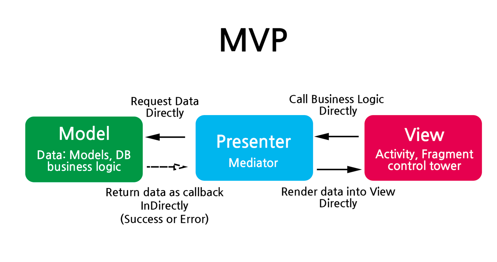
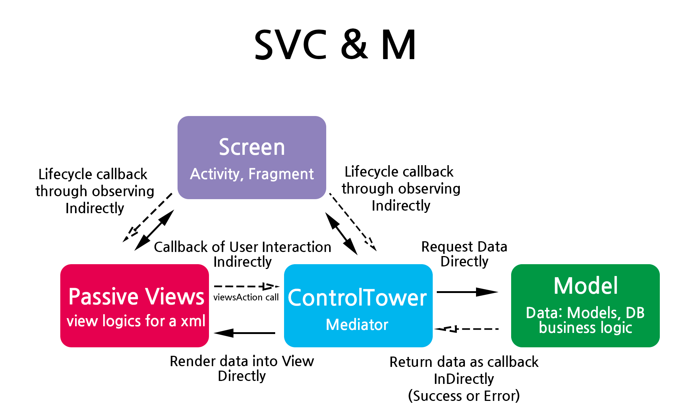

# SVC

**Easy** and **intuitive** pattern **library** for Android


## Why SVC?

MVP and MVVM use Fragment or Activity as "VIew"

So when we write code inside the Fragment or Activity, codes are getting mixed with
"View" code and "Screen Code" such as `onCreate,onCreateView, onViewCreated` or `onSaveInstanceState, onRestoreInstanceState `.`onActivityResult` etc.

It makes hard to see each "View Logic" and "Screen Logic"

And the most important thing is that "Business Logic" can be included in the "View"(Fragment, Activity) easily.

It's because Activity, Fragments are actually "Control Tower" (control lifecycle and receives view events)

SVC gives the way how to divide Screen, View and Business Logic.


For more read check article below

1. 4 reasons why MVP is not good enough
   [https://medium.com/@bansooknam/intro-svc-the-better-pattern-against-mvp-138e6e790bbc](https://medium.com/@bansooknam/intro-svc-the-better-pattern-against-mvp-138e6e790bbc)

2. Detail concept of SVC
   [https://medium.com/@bansooknam/svc-the-better-pattern-against-mvp-66e6d342a23f](https://medium.com/@bansooknam/svc-the-better-pattern-against-mvp-66e6d342a23f)

   

Ps. It can be used with ViewModel as Well.
you can check an example here below.
https://github.com/BansookNam/android-architecture


## Examples

### 1. Activity

```kotlin
class MainActivity : SvcBaseActivity<MainViews, MainCT>() {
    override fun createViews() = MainViews(this)
    override fun createControlTower() = MainCT(this, views)
}

```

### 2. Fragment

```kotlin
class StatisticFragment : SvcBaseFragment<StatisticViews, StatisticCT>() {
    override fun createViews() = StatisticViews(this)
    override fun createControlTower() = StatisticCT(this, views)
}
```


You can really **divide** "Views" from Activity and Fragment.

so you can see logic about real Fragment and Activity very well like below. ([source link](https://github.com/BansookNam/android-architecture/blob/todo-svc-kotlin/todoapp/app/src/main/java/com/example/android/architecture/blueprints/todoapp/screen/taskdetail/TaskDetailActivity.kt))

```kotlin
class TaskDetailActivity : SvcBaseActivity<TaskDetailViews, TaskDetailCT>() {

    override fun createControlTower() = TaskDetailCT(this, views, taskId!!)
    override fun createViews() = TaskDetailViews(this)

    var taskId: String? = null

    override fun onCreate(savedInstanceState: Bundle?) {
        /**
         * we should set taskId before super onCreate
         * because createControlTower will be called on super.onCreate()
         * and taskId is non null String type in constructor of TaskDetailCT
         */
        taskId = intent.getStringExtra(EXTRA_TASK_ID)

        super.onCreate(savedInstanceState)
    }

    override fun onSupportNavigateUp(): Boolean {
        onBackPressed()
        return true
    }


    override fun onOptionsItemSelected(item: MenuItem): Boolean {
        val deletePressed = item.itemId == R.id.menu_delete
        if (deletePressed) ct.deleteTask()
        return deletePressed
    }

    override fun onCreateOptionsMenu(menu: Menu?): Boolean {
        menuInflater.inflate(R.menu.taskdetail_fragment_menu, menu)
        return true
    }

    fun startEditTastActivity(taskId: String) {
        val intent = Intent(this, AddEditTaskActivity::class.java)
        intent.putExtra(AddEditTaskActivity.ARGUMENT_EDIT_TASK_ID, taskId)
        startActivityForResult(intent, REQUEST_EDIT_TASK)
    }

    override fun onActivityResult(requestCode: Int, resultCode: Int, data: Intent?) {
        if (requestCode == REQUEST_EDIT_TASK) {
            // If the task was edited successfully, go back to the list.
            if (resultCode == Activity.RESULT_OK) {
                setResult(Activity.RESULT_OK)
                finish()
            }
        }
    }

    fun finishAfterDelete() {
        setResult(Activity.RESULT_OK)
        finish()
    }

    companion object {
        const val EXTRA_TASK_ID = "TASK_ID"
        const val REQUEST_EDIT_TASK = 1
    }

}
```


# Definition of “SVC”

Each alphabet stands for.

S — Screen

V — Views

C — Control Tower


+In addition

UseCase — Interface which have "User Interaction methods"

# Diagram

## 1. SVC


1. Each "Screen" has "Views" and "CT"(control tower).
2. "Views" don't know "CT" directly. It knows "CT" as "UseCase"
3. "CT" knows "Views"'s public methods and fields.
4. Each "Views" and "CT" has "Screen"


## 2. MVP, MVVM




When we use MVP or MVVM, "View"(which is implemented on Activity, Fragment) can easily get Bigger with lots of responsibility. It has 3 main responsibility.

1. Screen logics
2. View logics
3. Control tower logics (access directly to Mediator "Presenter" or "ViewModel")


And both MVP, MVVM can call Business logics of Mediator directly.


## 3. SVC with Model



As same as MVP, Mediator("ControlTower") comunicated with Model.

It's exactly same.


We can use ViewModel in CT to take advantage of "Auto Lifecycle Management".

Especially when we call asynchronous call which take more than 100ms, using ViewModel would be a good choice.

## 4. Difference between MVP,MVVM vs SVC

There are 2 big differences.

1. SVC divides "View"'s 3 responsibilities into 3 parts, which is Screen, ControlTower, Views
2. "Views" cannot call "Control Tower" directly. (Because "Views" knows "CT" as "UseCase")


With this 2 big differences. We can

1. Prevent "View" from being "God View"
2. We can see well divided logics.
3. When we write "View" logic we don't need to think about business logics.
4. We don't need to make duplicated methods by interfaces (in MVP especially)
5. We don't need to observe commands with parameter (in MVVM)
6. We can use same "Views" in "A Activity" and "B Fragment". (reusable)
7. We can understand intuitively with clear naming.


# Implementation

### 1. Project Top Build.gradle

Packages are available in `jcenter`

Include below in your top build.gradle file

```groovy
allprojects {
    repositories {
        jcenter() //add this line
    }
}
```


### 2. Application Build.gradle

Include below in your "application" build.gradle file

```groovy
implementation "com.naver.android.svc:svc:0.0.1-alpha13"
```


### 3. Done! You can use it!


### 4. SvcTemplate can makes "works" easier

If you want to create Activity, Fragment, DialogFragment quickly. Try SvcTemplate.
 1) clone `https://github.com/naver/svc-template.git`

 2) run shell script through command line. (Terminal in mac)`./install.sh`

 3) restart Android Studio

 4) right click, and use "SVC" - "SVC ***"


 5) write screen name, author then finish!


6. **Happy coding!**


# Reuse of Views and CT

"Views" and "CT" can be reused in different Screens.
(It means it has same look or same usecase and proccess)

If you want to reuse you should refer your screen as "SvcScreen"
or make "Abstract Screen (implements SvcScreen)" with common methods then refer the "Abstract Screen" on your reused "Views" or "CT".


## License
SVC is licensed under the Apache License, Version 2.0.
See [LICENSE](LICENSE) for full license text.

```
Copyright 2018 NAVER Corp.

Licensed under the Apache License, Version 2.0 (the "License");
you may not use this file except in compliance with the License.
You may obtain a copy of the License at

    http://www.apache.org/licenses/LICENSE-2.0

Unless required by applicable law or agreed to in writing, software
distributed under the License is distributed on an "AS IS" BASIS,
WITHOUT WARRANTIES OR CONDITIONS OF ANY KIND, either express or implied.
See the License for the specific language governing permissions and
limitations under the License.
```